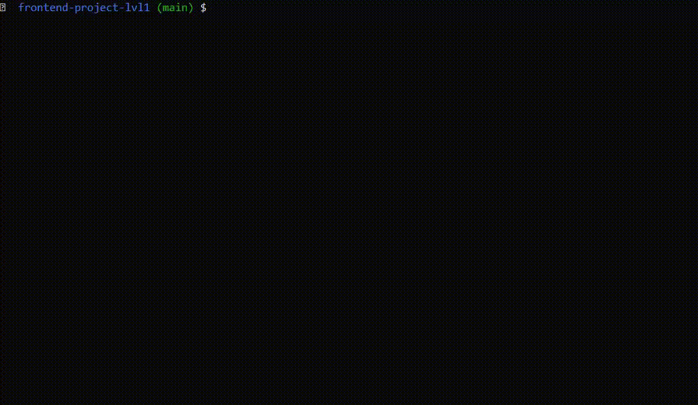
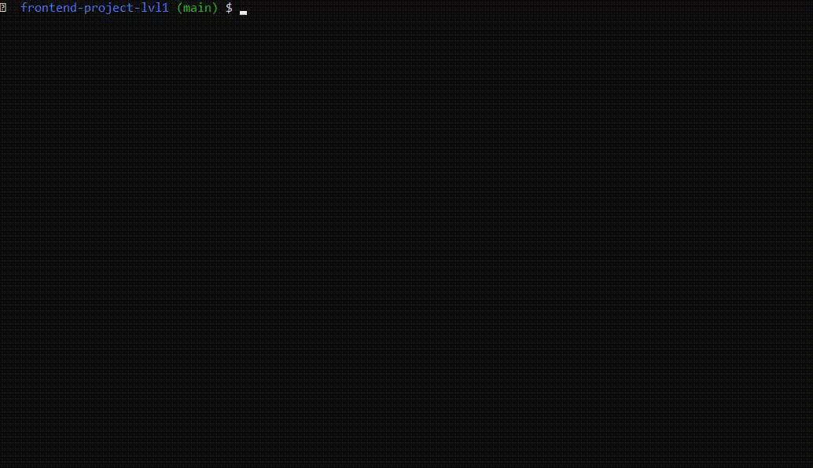
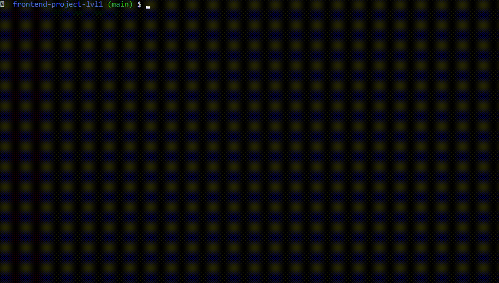

### Hexlet tests and linter status:

## Installation:
Clone this repository on your machine and write sudo npm link in the project directory. Implied that you have already installed Node.js

This is a console game. To start playing, type brain-even in the console.

• **Installation** from the local repository and **brain-even** demonstration:

• **brain-calc** demonstration:

• **brain-gcd** demonstration:
